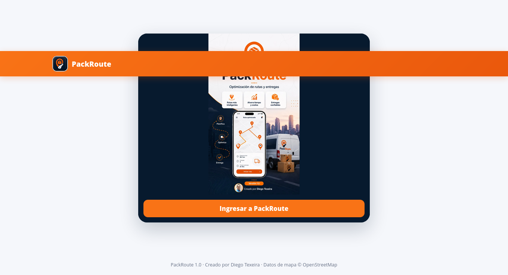
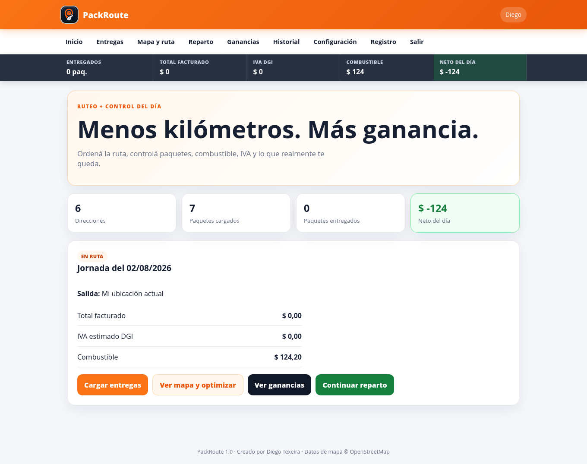
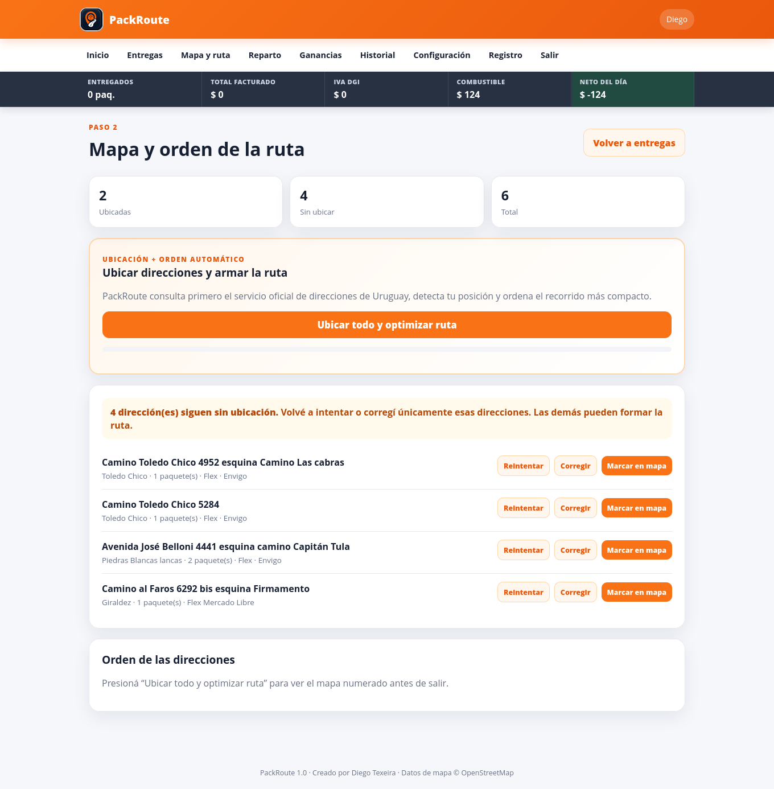
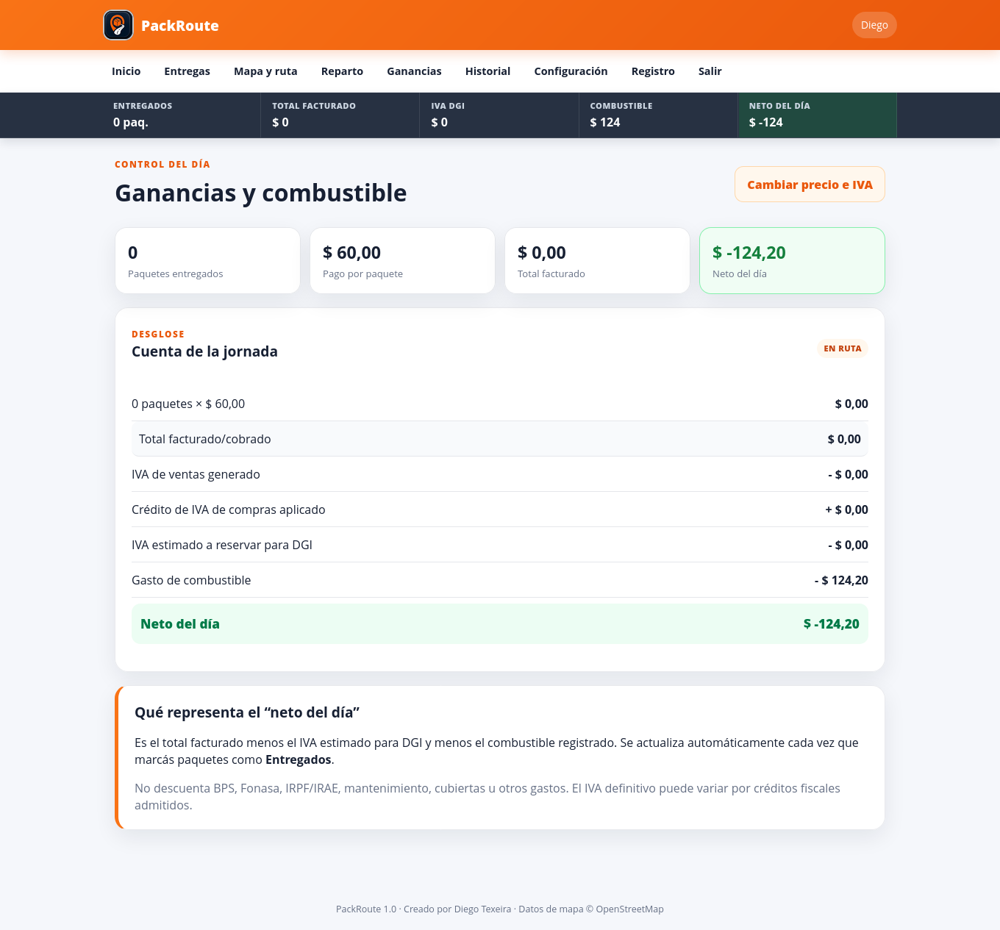
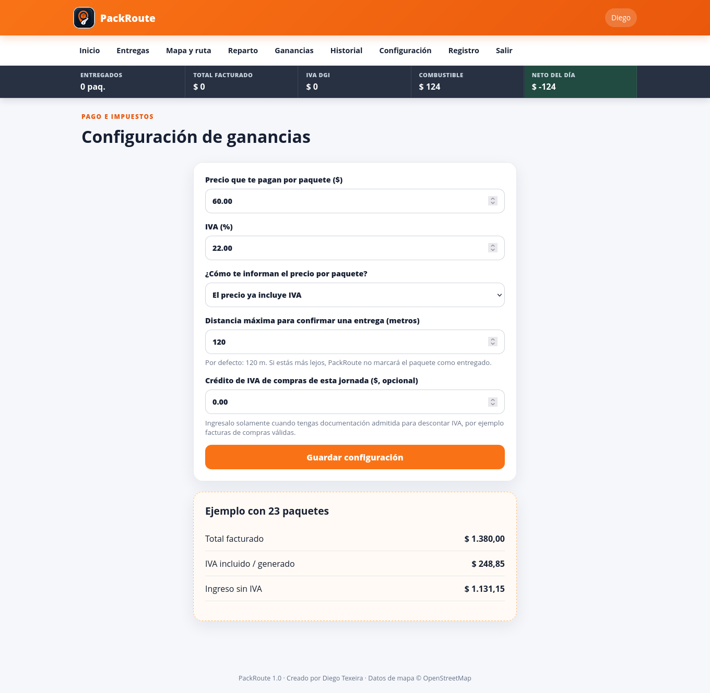

# PackRoute

Aplicación web para gestión y optimización de repartos.

PackRoute centraliza la jornada de reparto y permite organizar paquetes, preparar rutas, controlar entregas y visualizar el resultado económico de cada jornada.

## Capturas

### Acceso

### Dashboard

### Mapa y preparación de ruta

### Ganancias y combustible

### Configuración de ganancias

## Funcionalidades destacadas

- Registro y organización de paquetes.
- Gestión de direcciones y preparación de rutas.
- Control de entregas.
- Registro de combustible.
- Cálculo de facturación.
- Estimación de IVA.
- Neto de la jornada.
- Historial operativo.
- Configuración de pago por paquete.
- Control de distancia para validar entregas.

## Autor

Desarrollado por Diego Texeira.

## Uso en portfolio

Este repositorio puede utilizarse como documentación pública del proyecto y como fuente de imágenes para el portfolio de Texeira Web.
